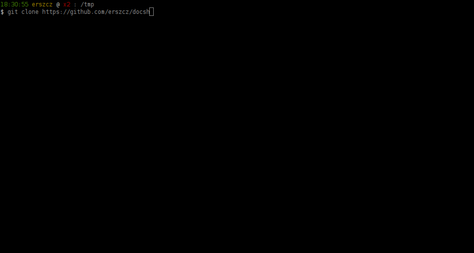

# Update on docsh

[gh:docsh]: https://github.com/erszcz/docsh
[gh:erln8]: https://github.com/metadave/erln8
[gh:kerl]: https://github.com/kerl/kerl
[docsh-goals]: https://medium.com/@erszcz/docs-in-the-shell-571cd7f246ef
[pp-not-easy]: https://github.com/erszcz/docsh/blob/4b469d3fea9a0e3de378f3401505b39e993522fc/notes.md#pretty-printing

It's been a while since I last posted,
but life has been so eventful that I barely had time for [docsh][gh:docsh],
not to mention writing for the blog.

Still, [since I wrote about the initial project goals in February][docsh-goals],
it's changed a lot.
The initial idea was to embed documentation and type information
in .beam files and distribute such instrumented files.
While this is implemented and works,
it's problematic to do the same with OTP applications' modules.
I considered a couple of approaches for using docsh with OTP:

-   Providing a demo OTP fork for installing with [`kerl`][gh:kerl]
    or [`erln8`][gh:erln8] which would use docsh.
    While relatively easy to pull off for a demo,
    since just some simple steps in the build process would have to be added,
    it would be completely unusable as a handy tool for everyday tasks.
    Moreover, supporting different versions, staying up to date with new releases...
    it's definitely not a set of tasks for a side project.

-   Requiring the user to tinker with the build process so that the OTP
    .beam files are properly instrumented.
    In this scenario the workload would be distributed among the user base (which is good),
    but the hindrance this introduces would most probably lead to
    ultimately no one trying the project out (which is bad).

-   Providing instrumentation on-the-fly when a user requests documentation
    for a particular module in the shell.
    Since all the pieces of the puzzle were already in place,
    the most logical choice was to simply use them on user request,
    instead of plugging into the chain of build steps.

All of the above have their cons and pros,
but I believe the last one is the most convenient to use on an everyday basis.
What is also important is that it
does not interfere in any way with using the project as a Rebar plugin.
To cut the long story short, this is what docsh give you now:

Putting this into words:

-   `docsh` extracts EDoc documentation from modules and provides it in the
    Erlang shell.

-   It also extracts type information from the debug information /
    abstract syntax tree / module source (if available)
    and also provides it in the shell.

-   Actually, the architecture is flexible so that it's easy
    to add support for new `docsh_reader`s for different documentation
    formats/sources, not just the two mentioned above.

-   There are a few [`user_default`](http://erlang.org/doc/man/shell_default.html)
    snippets for seamless integration with `erl`.

-   It does its best to pretty print types and specs,
    which [turned out not to be a piece of cake][pp-not-easy].

However, there's still a caveat to keep in mind.
Erlang "source" tarballs aren't really source tarballs - just the
C code is compiled on your machine if you "install from source".
What does it mean for docsh?
If `debug_info` isn't available in a .beam file
(and it's not the case for the OTP modules)
docsh looks for a source file the module is compiled from.
If the location of this file is not a valid path on the local machine,
docsh won't find the .erl and fail.
The project repository contains a description of steps needed
to carry out to make docsh work with OTP modules.

[Have a look at the README](https://github.com/erszcz/docsh#use-it),
try it out and let me know what you think.
