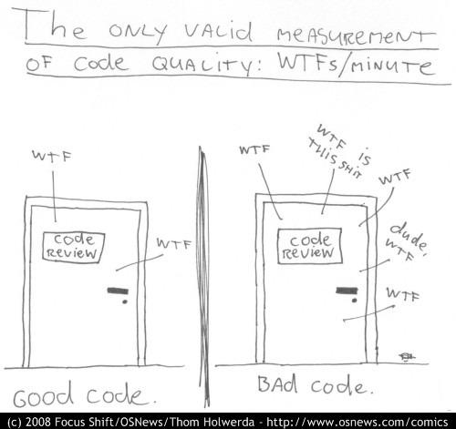

# Kafka, Brod, and the Ig Nobel in C++ literature

TL;DR:
Redpanda is to Kafka, what Scylla is to Cassandra,
that is a high-performance C++ rewrite of an otherwise well-known and
popular project and API.
Below I describe how I resolved an Elixir Kaffe and Erlang Brod consumer
group rebalance issue when Vectorized Redpanda, instead of the original Apache Kafka,
was the message broker.
[The change was sent upstream and successfully merged by the kafka4beam team][brod-pr]. Thanks!

[brod-pr]: https://github.com/kafka4beam/brod/pull/465

As the summary says, [Vectorized Redpanda](https://vectorized.io/redpanda/)
is a high performance C++ implementation of the Apache Kafka broker, protocol,
and the complete producer/consumer model:

> A Kafka® API compatible streaming platform for mission-critical workloads.

In one of my most recent projects I had a chance to work with Redpanda,
which is still a relatively new piece of technology.
And working with new technology may be quite exciting, quite so when it
works well, but possibly even more when it doesn't.
In each case, the excitement is just of a bit different kind ;)

The system was architected as a set of Elixir microservices communicating via a message broker.
Some of them were exposed to the public via a CDN, but the majority
processed events consumed from the broker and interfaced with two distinct databases.
All the components ran on Kubernetes.
All in all, communication with the message broker was crucial.

The system was supposed to handle user money,
which was one of the arguments for using Kafka / Redpanda, since they're persistent message brokers.
After some preliminary research and prototyping of the retry mechanisms
available in various Kafka client libraries we decided to go with [Elixir Kaffe][kaffe].
The library does everything we would have to do anyway if using [Brod][brod] directly,
packages it in a nice Elixir wrapping, yet doesn't shoehorn the underlying
model into an oversimplified or cumbersome abstraction.

[kaffe]: https://github.com/spreedly/kaffe
[brod]: https://github.com/kafka4beam/brod

However, it has soon become worrying that configuring our services to
consume from more than one topic made it practically impossible to process any messages.
The service startup was taking more time than expected, then at most a few messages
were consumed, then the service was getting disconnected from the broker and tried reconnecting.

We tried switching between Kaffe's `:worker_per_partition` and `:worker_per_topic_partition`
allocation strategies, but with no luck.
By trial and error we confirmed the problem only manifests when the
service is configured to consume from more than one topic.
Ultimately, some code diving into Kaffe and Brod and the tried and tested techniques of tracing
BEAM code (`dbg` is great even in Elixir!) led me to pinpoint the problem to subscribers being
disconnected from the broker.
The question that remained unanswered was why.

Fortunately, Redpanda logging can be very granular when the
`--default-log-level=trace` option is passed to `rpk`.

redpanda.trace.1.log

As you can see, the level of detail is overwhelming,
so it felt like looking for a needle in a haystack.

If you're interested in what exactly is happening in the log above, then here it goes.
We can see on line 1 the Erlang process 962 (`nonode@nohost/<0.962.0>`) joins.
It becomes the group leader on line 7. On line 27 another process joins - 968.
On line 29 process 962 is still the group leader, on line 30 process 968 is added to the group.
On line 34 we get info that not all members have rejoined yet, and on line 35 that join completion
is scheduled with a negative timeout.
This leads to 962, the group leader, being kicked out on line 38.
The log is much longer, with yet another process joining later, 968 being kicked out,
this new process becoming the leader... then process 962 joining back again,
the same thing repeating, and ultimately the processes looping like that
kicking each other out indefinitely.

With some time it made sense - the [consumer group][consumer-groups] was
rebalancing with no apparent reason.
Tweaking [Redpanda options](https://vectorized.io/docs/configuration/) (e.g. `heartbeat_rate`,
`rebalance_delay_ms`) and their counterparts on Brod side didn't give any reasonable effects.

[consumer-groups]: https://docs.confluent.io/platform/current/clients/consumer.html#consumer-groups

Having scratched my head for a while, I retried with Redpanda v21.7.3.
Some log messages had different wording or format, but in general, the same scenario happened.
It occurred to me I'm not getting any further with this line of investigation,
so I realised the next step is to search the Redpanda broker source for relevant messages like
`Scheduling initial debounce join timer for 5000 ms` and `Join completion scheduled in ...`.
Who would've expected that dabbling in C++ in high school would pay off 15 years later?

It turned out that [rebalance timeout computation][rebalance-timeout-comp] returned -1,
which did not seem to be a reasonable timeout value, especially given there's a clause
which should've raised an exception if this timeout couldn't be computed.
The -1 seemed to be the `rebalance_timeout` field of the existing `group_members`,
but I wasn't sure how it got there.
It came from a [`join_group_request` class][join-group-req-class],
which in turn got it from `join_group_request_data` struct, but the last one did not seem to be
defined in [the repo](https://github.com/vectorizedio/redpanda/search?q=join_group_request_data).
This lead me to check if our client actually sent the `rebalance_timeout` value on `join_group`
request - after all, it might've been an issue on our end.

[rebalance-timeout-comp]: https://github.com/vectorizedio/redpanda/blob/a8d19c32c95c2c313e7eea69defc058a8b269e2b/src/v/kafka/server/group.cc#L251-L264
[join-group-req-class]: https://github.com/vectorizedio/redpanda/blob/a8d19c32c95c2c313e7eea69defc058a8b269e2b/src/v/kafka/server/group.cc#L630-L641

I worked on this further and my research showed that Brod didn't send the `rebalance_timeout_ms`
field on the `join_group` request.
[Hacking the lib to do that allowed the group to stabilise and an according
PR was accepted by the kafka4beam team][brod-pr].
To be precise, the library used to default to request version 0,
which did not define `rebalance_timeout_ms` yet.
So technically speaking the library was not buggy - it just tried to use the lowest supported
protocol version with the hope it would work.
In conjunction with the broker-side timeout default of -1 it led to an indefinite
consumer group rebalance cycle.
[@zmstone](https://github.com/zmstone), one of Brod maintainers,
[pointed out](https://github.com/kafka4beam/brod/pull/465#discussion_r673058528)
that newer Kafka versions fall back to using session timeout for rebalance timeout,
if the latter is not available - I forwarded that to the Vectorized team,
so hopefully that'll get incorporated in some future version of Redpanda.
Apart from this one glitch, we had no issues with Redpanda or Kaffe/Brod whatsoever.

To sum up:

-   Redpanda does deliver on the convenience front (with `rpk`, a single command
    to create topics, produce example messages, consume from a topic,
    and with no reliance on Zookeeper),
    but we haven't yet had a chance to verify the performance promise yet.
    The tracing log level provides an unbelievable level of detail.

-   It's worth learning some C++ in high-school ;)

-   BEAM tracing is awesome and works just as well in Elixir, as it does
    in Erlang. And it doesn't require instrumenting the code upfront,
    like you have to do in C++.

-   Both the [spreedly/kaffe](https://github.com/spreedly/kaffe) and
    [kafka4beam/brod](https://github.com/kafka4beam/brod)
    teams have done a great job building these awesome
    libraries!

Thanks for your time and stay safe!
